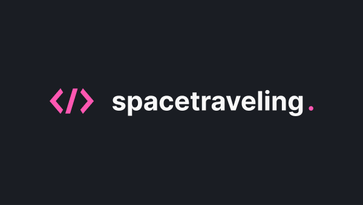

# spacetraveling

<div align="center">
  
  <!--  -->
</div>

## About this project

A application of a blog page developed at [Rocketseat's](https://www.rocketseat.com.br/) _Ignite ReactJS_ course using ReactJS and NextJS. In this app everyone has access to all posts, each page has a navigation menu between posts and a comment area. Another feature is Prismic CMS's ability to preview posts before publishing.

This app was developed following Rocketseat's Ignite React Challenges [1](https://www.notion.so/Desafio-01-Criando-um-projeto-do-zero-b1a3645d286b4eec93f5f1f5476d0ff7) and [2](https://www.notion.so/Desafio-02-Adicionando-features-ao-blog-d466866c02544c79bbada9717c033d0a).

## Figma

You can access the application layout in the Figma [project](https://www.figma.com/file/0Y26j0tf1K2WB5c1ja5hov/Desafios-M%C3%B3dulo-3-ReactJS/duplicate).

## Technologies and tools

- [ReactJS](https://reactjs.org/) as library
- [NextJS](https://nextjs.org/) as framework
- [TypeScript](https://www.typescriptlang.org/) as programming language
- [SCSS](https://sass-lang.com/) for styling
- [Prismic CMS](https://prismic.io/) for post management
- [Utteranc](https://github.com/utterance/utterances/) for the comments

## Demonstration


## Production

The application can be accessed [here](https://spacetraveling-igoormichaeel.vercel.app/).

## Getting Started

### Requirements

To run this project in the development mode, you'll need to have:
- [Git](https://git-scm.com/)
- [Yarn](https://classic.yarnpkg.com)

### Installing

On terminal, clone de repository and go to the directory
```bash
$ git clone https://github.com/igoormichaeel/spacetraveling.git
$ cd spacetraveling
```
And execute the following command to install all de dependencies:

```bash
$ yarn
```

Then, to runs the app in the development mode, execute:

```bash
$ yarn dev
```

Open [http://localhost:3000](http://localhost:3000) to view it in the browser.
